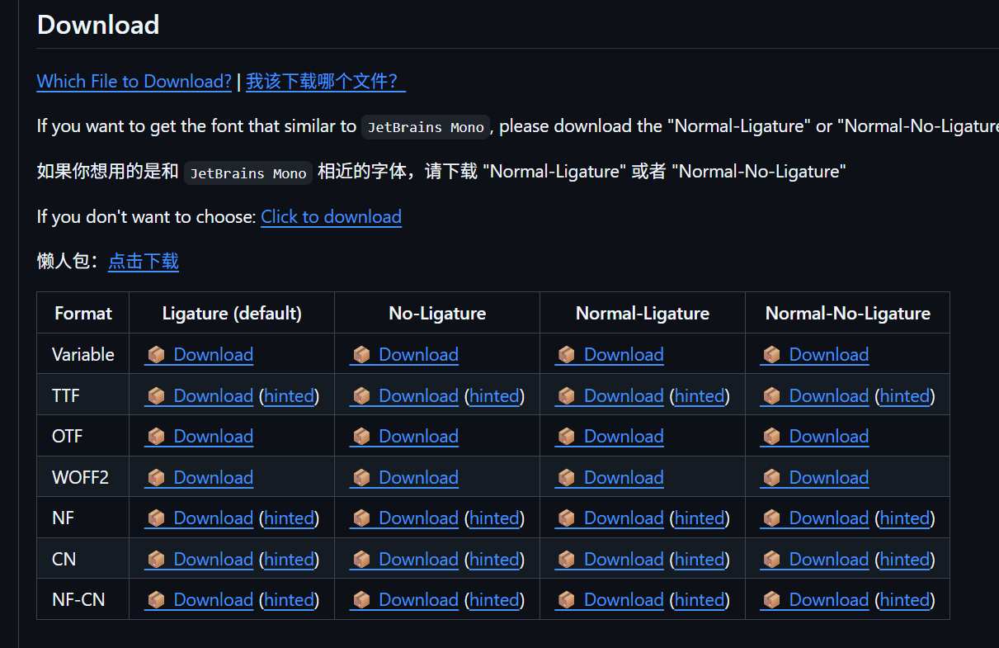
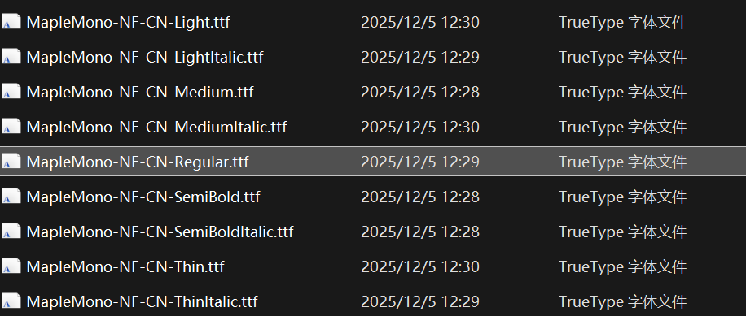
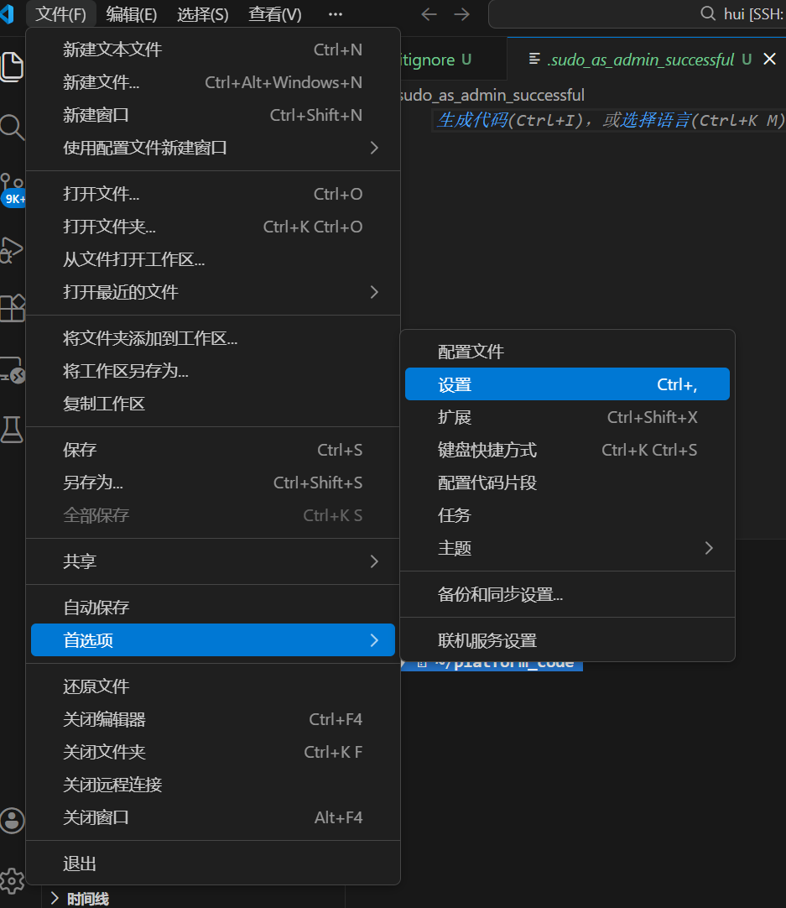
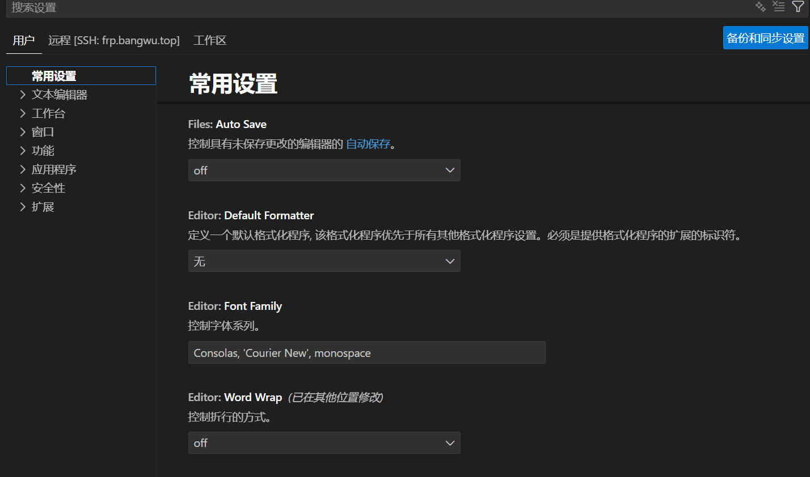
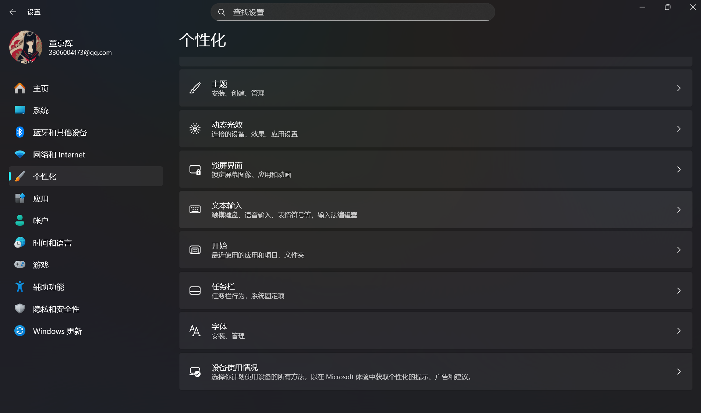
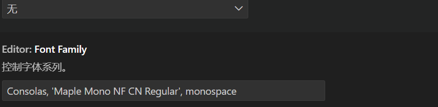
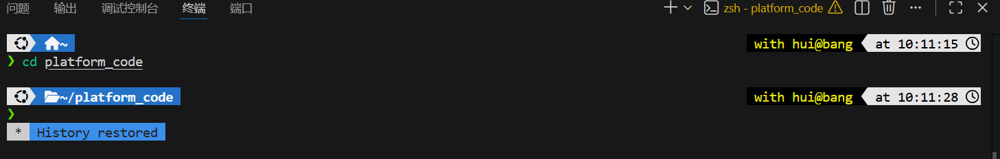

一个简单的教程，关于如何修改Visual Studio Code的字体，因为Visual Studio Code的默认字体显示不出来很多特殊符号，所以自定义更改适配的字体很重要。

## 一、寻找适配的字体

我找的是Maple NF-CN的字体

链接在这里：[字体的GitHub链接](https://github.com/subframe7536/Maple-font)

进入下载链接后，下载懒人包，下载完毕后，解压打开选择自己喜欢的字体安装。

我一般选择MapleMono-NF-CN-Regular.tff，双击打开后，点击右上角安装即可

## 二、Visual Studio Code设置

左上角-文件-首选项-设置

常用设置里面，找到Editor:Font Family；Consolas,'Courier New',momospace，把'   '中间替换成你想要的字体即可。

## 三、如何寻找字体名字

Windows-设置-个性化-字体

在里面寻找之前安装的字体即可

Visual Studio Code修改完后的格式如下。

效果预览

